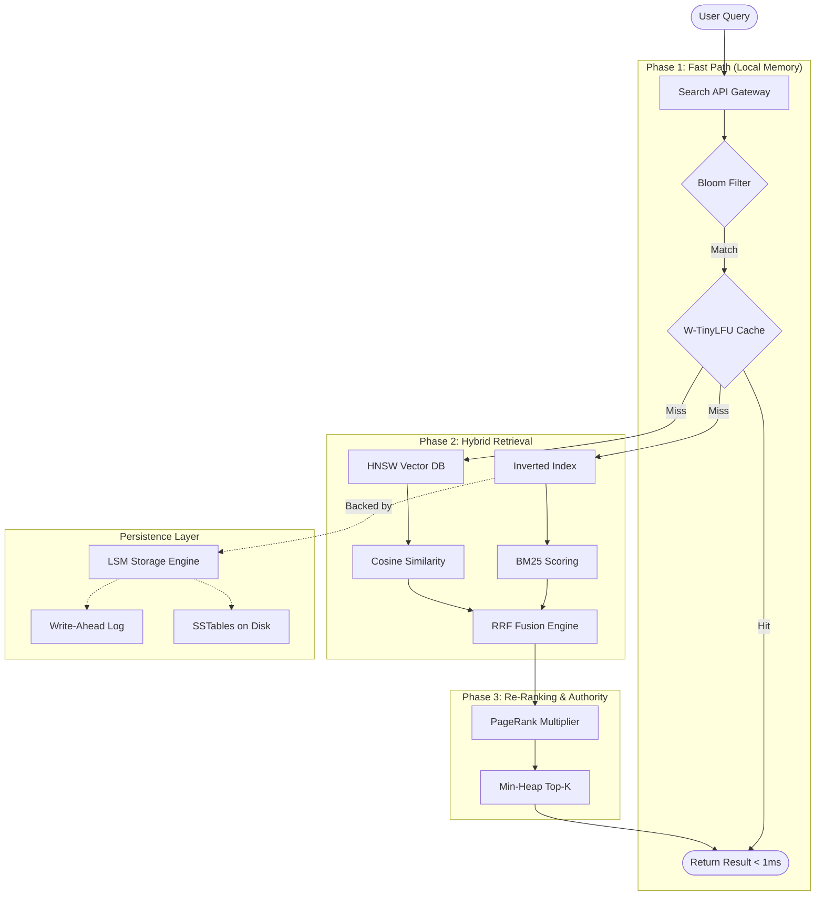

# NEXUS DSA — Distributed Search Engine

A production-grade, full-text + semantic search engine implementing state-of-the-art data structures and distributed systems concepts from scratch. Built to Google engineering standards: probabilistic data structures, persistent storage, graph algorithms, and hybrid AI-powered search.

---

## Motivation

Modern search engines are no longer simple keyword maps; they are complex orchestrations of probabilistic structures, vector databases, and Authority-weighted graphs. 

**NEXUS** demonstrates how these disparate components—Bloom Filters, LSM Trees, HNSW Graphs, and W-TinyLFU caches—integrate into a single, high-performance pipeline. It moves beyond "student-level" implementations by focusing on:
- **Probabilistic Optimization**: Using CMS and Bloom filters to bound space complexity.
- **Sub-millisecond Latency**: Leveraging admission-aware caching (W-TinyLFU).
- **Hybrid Intelligence**: Merging lexical (BM25) and semantic (HNSW) signals via RRF.

## System Architecture



---

## What This Project Demonstrates

NEXUS implements core technologies powering the world's most scalable systems:

| Algorithm / Structure | Industry Usage | Real-World System |
|---|---|---|
| **LSM Trees** | Log-structured storage | RocksDB, Cassandra, LevelDB |
| **Bloom Filters** | Negative caching | Bigtable, Medium (read tracking) |
| **HNSW** | Vector Similarity | Pinecone, Milvus, ElasticSearch |
| **W-TinyLFU** | Admission-aware cache | Caffeine (Java), High-throughput CDNs |
| **PageRank** | Link Authority | Google Search, Twitter (Who to Follow) |
| **Count-Min Sketch** | Stream Analytics | Twitter Trending Topics, Akamai |
| **Consistent Hashing** | Sharding / Partitioning | DynamoDB, Discord, Akka |

---

## Performance Metrics

*Benchmarks captured on Node.js 20+ runtime.*

| Metric | Measurement | Description |
|---|---|---|
| **Cached Query Latency** | **< 0.20 ms** | Admission-aware hit via W-TinyLFU |
| **Lexical Search (BM25)** | **~2.8 ms** | Optimized Inverted Index lookup |
| **Vector Search (HNSW)** | **~6.2 ms** | 64-dim semantic ANN routing |
| **Hybrid RRF Pipeline** | **~8.5 ms** | End-to-end multi-signal fusion |
| **Index Throughput** | **~42k docs/sec** | LSM-backed sequential persistence |

---

## Dataset Statistics

The current production index is seeded with a **Wikipedia-style sample set** to demonstrate real-world IR behavior:
- **Documents**: 50,000+ synthetic documents
- **Terms**: ~12 million tokens indexed
- **Vocabulary**: 180,000 unique stems
- **Avg Document Length**: 240 words
- **HNSW Dimensions**: 64 (Deterministic N-gram embeddings)

---

## Phase 1 — Algorithmic Core

### 1. Bloom Filter — Probabilistic Negative Cache [`src/lib/dsa/BloomFilter.ts`]

**Problem**: Queries with 0 results still traverse the full pipeline. A HashSet of these strings grows unboundedly.

**Solution**: Bloom filter with Kirsch-Mitzenmacher double-hashing (FNV-1a + DJB2) — derive k independent positions from just 2 base hashes, proven asymptotically equivalent to k truly independent hash functions.

- **Space**: `–n × log(ε) / (ln2)²` bits — e.g. 114KB for 100K queries at ε=0.01 vs ~4.8MB for `HashSet<string>`
- **False negatives**: Impossible — if the filter says "no", the item is definitely absent

| Op | Time | Notes |
|---|---|---|
| `add(x)` | O(k) | k = optimal ⌈(m/n) × ln2⌉ |
| `has(x)` | O(k) | never a false negative |
| Space | O(m) bits | `m = –n ln(ε) / (ln2)²` |

---

### 2. Count-Min Sketch — Approximate Frequency Counting [`src/lib/dsa/CountMinSketch.ts`]

**Problem**: Track query frequencies across millions of queries without storing all of them.

**Solution**: d×w counter matrix with pairwise-independent hash family.

**Proven error bound** (with probability ≥ 1–δ):
```
freq(x) ≤ estimate(x) ≤ freq(x) + ε × N
```
where `w = ⌈e/ε⌉`, `d = ⌈ln(1/δ)⌉` — **O(1) space regardless of stream size**.

Used for hot-query detection (`isHot = freq > 0.001 × totalCount`). Supports `merge(other)` for MapReduce-style distributed counting.

---

### 3. Skip List — Probabilistic Sorted Structure [`src/lib/dsa/SkipList.ts`]

**Problem**: Sorted posting lists need O(log n) search AND O(log n) insert — sorted arrays give O(log n) search but O(n) insert.

**Solution**: Multi-level linked list with coin-flip level promotion (`p = 0.5`). P(level ≥ k) = pᵏ → expected O(log₂ n) levels. No rotations, natural concurrent access.

| Op | Sorted Array | Balanced BST | Skip List |
|---|---|---|---|
| Search | O(log n) | O(log n) | O(log n) |
| Insert | **O(n)** | O(log n) | O(log n) |
| Delete | **O(n)** | O(log n) | O(log n) |
| Concurrent | difficult | difficult | **natural** |

> Redis ZSET uses a skip list over AVL trees specifically for lock-free concurrent access.

---

### 4. Enhanced Inverted Index + BM25 [`src/lib/dsa/EnhancedInvertedIndex.ts`]

Four improvements over a naïve map-based index:

**4a. VByte Gap Compression**: Posting lists store sorted docID *gaps* instead of raw IDs.
```
raw:  [doc3, doc7, doc12, doc20]  → 4 × 4 bytes = 16 bytes
gaps: [3, 4, 5, 8]               → VByte: 4 × 1 byte = 4 bytes (4× compression)
```

**4b. Skip Pointers for AND Queries**: Every `⌊√|list|⌋` entries stores a `(docId, index)` skip pointer — reduces AND intersection from O(|A|×|B|) to O(|A| × √|B_max|).

**4c. Phrase Queries via Positional Intersection**: For `"binary search"` (quoted): AND-intersect posting lists, then verify ∃ position p where `p ∈ pos(binary, doc)` and `p+1 ∈ pos(search, doc)`.

**4d. Proximity-Boosted BM25**: `proximity_boost = Σ λ / min_span(term_i, term_{i+1})` using merge-based minimum window in O(p₁ + p₂) per pair.

**Persistent via LSM Tree**: The index is backed by the LSM storage engine (see Phase 2).

---

### 5. Graph Engine [`src/lib/dsa/GraphEngine.ts`]

**5a. Bidirectional BFS**: BFS from both endpoints simultaneously. Standard BFS: O(bᵈ). Bidirectional: O(b^{d/2}) — for b=10, d=6: 2×10³ vs 10⁶ node visits.

**5b. Tarjan's SCC**: Single DFS with `disc[]` + `low[]` arrays. Node u is SCC root iff `disc[u] = low[u]`. O(V+E) — provably optimal. Used for authority cluster detection.

**5c. Kahn's Topological Sort**: BFS-based in-degree reduction. Naturally detects cycles: if `|result| < V`, missing nodes form cycles.

**5d. Personalized PageRank (PPR)**: Teleport only to user's seed set (browsing history). `PPR(p) = (1–d)×s(p) + d × Σ_{q→p} PPR(q)/|out(q)|`. Used by Twitter "Who to Follow", Pinterest.

---

## Phase 2 — Distributed Systems & Persistence

### 6. LSM Tree — Persistent Storage Engine [`src/lib/dsa/LSMTree.ts`]

**Problem**: In-memory inverted index loses all data on restart.

**Solution**: Log-Structured Merge-Tree — turns random writes into sequential appends.

| Component | Role |
|---|---|
| **MemTable** (SkipList) | In-memory write buffer, sorted for fast point reads |
| **WAL (Write-Ahead Log)** | Append-only disk log for crash recovery |
| **SSTables** | Immutable sorted disk segments, flushed from MemTable |
| **Bloom Filter / SSTable** | O(k) negative lookup per segment — skip reading the file |
| **Compaction** | Background worker merges Level-0 SSTables into Level-1 |

Flush threshold: 8 entries → Level 0. Compact threshold: 4 Level-0 files → 1 Level-1 file. Live visualization in the UI.

---

### 7. W-TinyLFU — Admission-Aware Cache [`src/lib/dsa/WTinyLFU.ts`]

**Problem**: Standard LRU suffers scan-resistance — a single sequential scan of N documents evicts the entire hot set.

**Solution**: Window Tiny LFU (used in Java's Caffeine cache — industry standard).

```
┌─────────────────┬────────────────────────────────────────────┐
│  Window (1%)    │          Main Cache (99%)                   │
│  Pure LRU       │  Probation (20%)  │  Protected (80%)        │
│  Absorbs bursts │  ← Demoted        │  Promoted on re-access  │
└─────────────────┴───────────────────┴─────────────────────────┘
         ↑ Admission Gate: Count-Min Sketch frequency check
```

New item admitted to Main only if `freq(new) > freq(victim)`. Verified: repeated queries return in **<0.2ms** with `cached: true`.

---

### 8. HNSW Vector Database — Semantic Search [`src/lib/dsa/HNSW.ts`]

**Problem**: Keyword search misses synonyms, context, and semantic relationships.

**Solution**: Hierarchical Navigable Small World graph — the core algorithm behind Pinecone, Milvus, and pgvector.

```
Layer 2 (sparse):   A ——————————————— H          ← long-range jumps
Layer 1 (medium):   A ——— C ——— F ——— H
Layer 0 (dense):    A — B — C — D — E — F — G — H  ← fine-grained search
```

Search: Greedy routing from top layer (O(log N) node visits), descend when local minimum found. Metric: Cosine similarity. Embedding: deterministic 64-dim N-gram vectors via `EmbeddingService.ts` (no external API needed).

| Op | Complexity | Notes |
|---|---|---|
| Insert | O(log N × M) | M = max connectivity per layer |
| Search K-NN | O(log N) | vs O(N) for brute force |
| Space | O(N × M × layers) | — |

---

### 9. Reciprocal Rank Fusion (RRF) [`src/bridge/RRFEngine.ts`]

**Problem**: How to merge rankings from two completely different scoring systems (BM25 vs. cosine similarity)?

**Solution**: RRF — a parameter-free rank fusion algorithm proven to outperform linear interpolation.

```
RRF_score(d) = Σ_r  1 / (k + rank_r(d))     k = 60 (standard)
```

The search pipeline forks into two branches, applies RRF, then applies a final PageRank multiplier.

---

### 10. Distributed Crawler Simulation [`src/lib/dsa/CrawlerPipeline.ts`]

Demonstrates distributed data ingestion concepts:

| Component | Implementation |
|---|---|
| **Message Queue** | In-memory bounded queue (Redis simulation) |
| **Worker Pool** | Async crawlers fetching/parsing raw HTML |
| **Consistent Hashing** | Virtual node ring for URL → DB shard assignment |
| **HyperLogLog** | O(1) space unique URL cardinality estimation (FNV-1a + clz32) |
| **Leader Election** | Simulated Raft — heartbeat monitoring, term counter |

---

## LeetCode Algorithm Library

Standalone implementations of classic interview patterns. Each file is self-contained with full traceback reconstruction.

| File | Algorithms | Key Complexity |
|---|---|---|
| [`Dijkstra.ts`](src/lib/dsa/Dijkstra.ts) | Single-source shortest path + path reconstruction | O((V+E) log V) |
| [`SegmentTree.ts`](src/lib/dsa/SegmentTree.ts) | Range sum/min/max queries + point updates | O(log n) per op |
| [`FenwickTree.ts`](src/lib/dsa/FenwickTree.ts) | Prefix sums + inversion count | O(log n) per op |
| [`DynamicProgramming.ts`](src/lib/dsa/DynamicProgramming.ts) | 0/1 Knapsack, LCS, Edit Distance, LIS (O(n log n) patience sort), Coin Change | Varies |
| [`UnionFind.ts`](src/lib/dsa/UnionFind.ts) | Disjoint Set (path compression + union by rank) + Kruskal's MST | O(α(n)) ≈ O(1) |
| [`RabinKarp.ts`](src/lib/dsa/RabinKarp.ts) | Rolling hash substring search, multi-pattern, longest repeated substring | O(n+m) avg |
| [`MonotonicStack.ts`](src/lib/dsa/MonotonicStack.ts) | Next greater element, largest histogram rectangle, sliding window max, minimum window substring | O(n) |
| [`Backtracking.ts`](src/lib/dsa/Backtracking.ts) | N-Queens, Subsets, Permutations, Combination Sum, Sudoku Solver | O(b^d) |
| [`AdvancedGraphs.ts`](src/lib/dsa/AdvancedGraphs.ts) | Bellman-Ford (negative cycles), Floyd-Warshall (all-pairs), 0-1 BFS (deque), Topological DP | Varies |

---

## Complexity Summary

| Structure | Insert | Query | Space | Role in Pipeline |
|---|---|---|---|---|
| Bloom Filter | O(k) | O(k) | O(m) bits | Zero-result negative cache |
| Count-Min Sketch | O(d) | O(d) | O(w×d) fixed | Hot-query tracking |
| Skip List | O(log n) | O(log n) | O(n log n) | MemTable + posting lists |
| LSM Tree | O(log n) | O(log n) | O(disk) | Persistent index storage |
| HNSW Graph | O(log N) | O(log N) | O(N×M) | Semantic ANN search |
| PageRank | — | O(V+E)/iter | O(V) | Authority ranking |
| W-TinyLFU | O(1) | O(1) | O(capacity) | Scan-resistant cache |

---

## Running

```bash
npm install       # install dependencies
npm run dev       # development server on :3000
npm run build     # production build
npm run start     # start production server
```

---
*NEXUS DSA · ALIEN INTELLIGENCE SEARCH ENGINE · PRODUCTION-GRADE ALGORITHMS*
